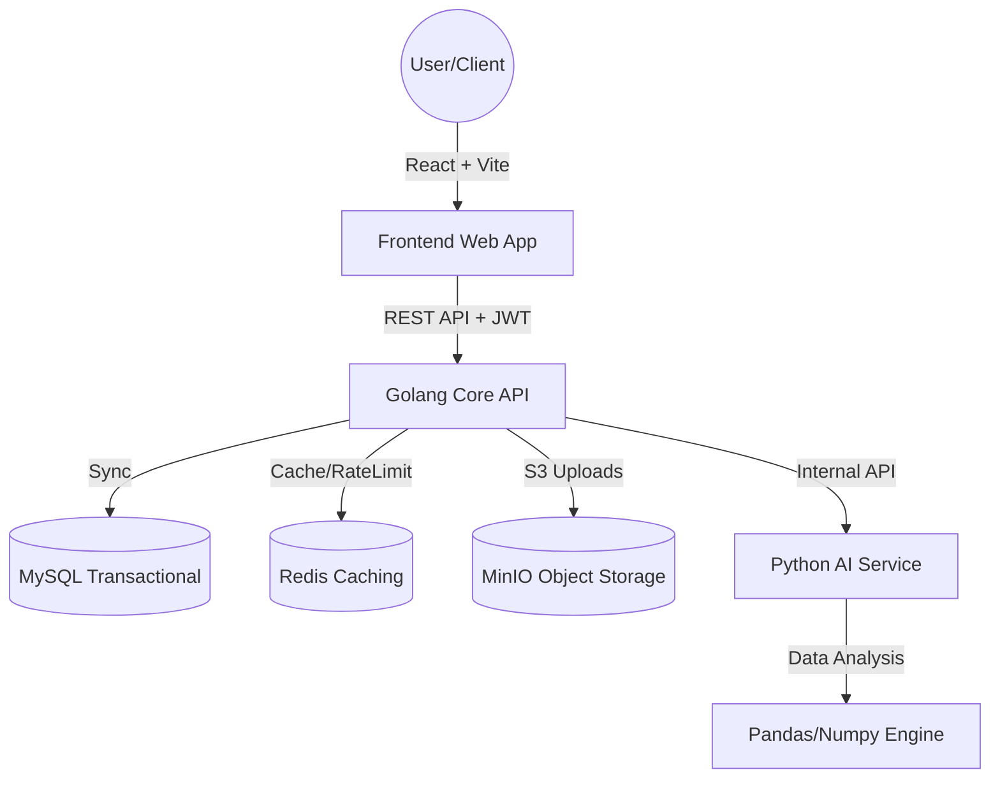

# Lakoo SaaS - Enterprise Cloud ERP Documentation

Lakoo SaaS is a sophisticated, multi-tenant Enterprise Resource Planning (ERP) platform designed to streamline business operations for Small and Medium Enterprises (SMEs). The system focuses on digitalizing core retail processes including sales, inventory management, financial auditing, and business intelligence through a distributed micro-service architecture.

## Table of Contents
1. [Project Background and Objective](#1-project-background-and-objective)
2. [System Architecture](#2-system-architecture)
3. [Tech Stack](#3-tech-stack)
4. [Comprehensive Directory Structure](#4-comprehensive-directory-structure)
5. [High-Detail Role-Based Access Control (RBAC)](#5-high-detail-role-based-access-control-rbac)
6. [Module Functionality Detail](#6-module-functionality-detail)
7. [Security and Hardening Specifications](#7-security-and-hardening-specifications)
8. [Installation and Infrastructure](#8-installation-and-infrastructure)
9. [Granular Project Structure Visualization](#9-granular-project-structure-visualization)

---

## 1. Project Background and Objective
The primary objective of Lakoo SaaS is to provide a unified, secure, and scalable ecosystem where businesses can manage their entire lifecycle from a single dashboard. 

### Target Audience
- **Retail & F&B Owners**: Seeking a centralized view of performance and team management.
- **Store Managers**: Needing robust operational tools for inventory and stock health.
- **Front-line Cashiers**: Requiring an efficient, low-friction POS interface for high-volume sales.
- **System Integrators**: Looking for a well-structured, multi-tenant Go/React boilerplate for ERP solutions.

---

## 2. System Architecture
The system follows a distributed micro-architecture pattern, ensuring high availability and fault isolation between the core ERP logic and the analytical intensive AI services.



### Components Interaction:
1. **Frontend**: Communicates with the Backend via REST API, managing local state with Zustand and data fetching with TanStack Query.
2. **Golang Core API**: Handles authentication, RBAC, CRUD operations, and coordinates with external services (Redis, MinIO, AI).
3. **Python AI Service**: Consumes transaction data provided by the Core API to generate demand projections and sales insights.
4. **Data Layer**: MySQL stores relational entities, Redis manages volatile sessions/rate-limits, and MinIO stores binary assets like QRIS images and logos.

---

## 3. Tech Stack

| Layer | Technology | Description |
| :--- | :--- | :--- |
| **Frontend** | React 18, TypeScript | Declarative UI and type safety. |
| **State/Query** | Zustand, TanStack Query | Lightweight state and robust server-state management. |
| **Styling** | Tailwind CSS, Shadcn UI | Utility-first styling and high-quality accessible components. |
| **Backend** | Golang 1.21+, Gin | High-performance compiled language for core business logic. |
| **AI Service** | Python 3.10+, FastAPI | High-speed Python framework for data-intensive processing. |
| **Analysis** | Pandas, Scikit-learn | Advanced data manipulation and statistical modelling. |
| **Database** | MySQL 8.0, Redis 7.0 | Relational storage and in-memory caching. |
| **Object Storage**| MinIO | S3-compatible storage for merchant branding assets. |
| **DevOps** | Docker, Docker Compose | Unified container orchestration for easy deployment. |

---

## 4. Comprehensive Directory Structure

### Project Root
- `client/`: The Frontend web application (React + Vite + TypeScript).
- `server/`: The Backend ecosystem containing the Go API and Python AI Service.
- `docker-compose.yml`: Orchestration file for unified system deployment.
- `lakoo.png` & `logo.png`: Main system branding assets.

### /server/api (Golang Clean Architecture)
The backend follows a domain-driven, layered architecture to ensure separation of concerns:
- `cmd/api/main.go`: The main entry point where all dependencies (DB, Redis, Storage) are wired.
- `internal/domain/`: Core business entities and repository/usecase interfaces (The "Source of Truth").
- `internal/dto/`: Data Transfer Objects for strictly typed request/response payloads and validation tags.
- `internal/usecase/`: Pure business logic layer. Orchestrates data flow between domains and repositories.
- `internal/repository/`: Data Access Layer (MySQL implementation using SQLX).
- `internal/http/handler/`: Delivery layer controllers that parse requests and return JSON responses.
- `internal/http/route/`: Centralized routing definition where middlewares and handlers meet.
- `internal/middleware/`: Security and utility layers (RBAC, Rate Limiting, JWT, Security Headers).
- `pkg/`: Reusable internal packages for Database, Config, Storage (MinIO), and Response standardizers.
- `migrations/`: SQL migration files for versioned database schema management.

### /server/ai-service (Python Analytical Layer)
- `main.py`: FastAPI entry point and routing definition.
- `services/`: Implementation of analytical logic using Pandas and Scikit-learn.
- `models/`: (Optional) Storage for trained regression models and data structures.

### /client (React Frontend)
- `src/components/`: Atomized UI components divided by feature (dashboard, inventory, pos, etc.).
- `src/pages/`: Page-level components corresponding to specific routes.
- `src/hooks/`: Custom TanStack Query hooks for synchronized data fetching and mutation.
- `src/store/`: Zustand stores for global state management (Auth, Theme, Sidebar).
- `src/lib/`: Utility libraries (API Axios instance, CSV parser, UI helpers).

---

## 3. High-Detail Role-Based Access Control (RBAC)

The system enforces three distinct access tiers to protect sensitive corporate assets and maintain operational discipline.

### **Tier 1: Owner (Chief Administrator)**
- **Scope**: Entire Tenant environment.
- **Staff Management**: Absolute control over the team. Can view the staff list, invite new members, and terminate existing accounts.
- **Financial Authority**: Access to the high-level Finance Ledger, profit margins, cost prices, and professional financial reports.
- **Branding & Config**: Can modify the Shop Profile, upload logos, and configure payment gateways (QRIS/Bank).
- **AI Access**: Full access to the Strategic Insights dashboard for long-term demand forecasting.

### **Tier 2: Manager (Operational Supervisor)**
- **Scope**: Daily shop operations and inventory management.
- **Inventory Rights**: Can create, update, and delete product listings. Responsible for stock reconciliation and supplier data.
- **Secondary Financials**: Can view the transaction ledger and sales trends to monitor shop performance.
- **Restriction**: Blocked from "Manajemen Tim" (Staff Management) to prevent unauthorized HR actions. Cannot change critical tenant configurations.

### **Tier 3: Cashier (Transaction Processor)**
- **Scope**: Point of Sale and physical inventory checking.
- **Transaction Flow**: Full access to the POS module for generating sales, taking payments, and printing receipts.
- **Inventory View**: Can browse the product list and search SKU/Stock levels to assist customers.
- **Masking & Hiding**: All "Cost Price" (HPP) data is hidden. Profit charts, expenses, and staff settings are completely inaccessible from both UI and API levels.

---

## 4. Module Functionality Detail

### **Point of Sale (POS)**
- **Stateful Cart**: Manages multiple items with real-time total calculation.
- **Voucher Integration**: Server-side validation of discount codes.
- **Payment Processing**: Multi-channel support (Cash, Bank Transfer, QRIS).
- **Post-Action**: Automatic receipt generation (Print-Ready) and instant synchronization with the Finance Ledger.

### **Inventory Management**
- **Cataloging**: Support for SKU, Sell Price, Cost Price, and Stock Units.
- **Stock Guard**: Visual indicators for "Low Stock" items based on custom minimum thresholds.
- **Bulk Import/Export**: Optimized CSV handling for migrating thousands of product data points.

### **Financial Ledger**
- **Audit Trail**: Every sale and expense is timestamped and categorized.
- **Reporting**: PDF export module for generating professional balance sheets.
- **Real-time Metrics**: Instant calculation of Balance, Total Income, and Total Expenses.

### **AI-Powered Analytics**
- **Sales Insights**: 7-day rolling revenue chart with interactive tooltips.
- **Demand Projection**: AI logic analyzing transaction density to recommend restock quantities.

---

## 5. Security and Hardening Specifications

### **Brute-force Mitigation**
Powered by a Redis-based Rate Limiter. Attempts to access the `/auth/login` endpoint are tracked by IP and Email identity. 
- **Limit**: MAX 5 attempts.
- **Window**: 15 Minutes.
- **Action**: Automatic block with 429 status response.

### **Global Security Headers**
The following headers are injected into every API response via `SecurityMiddleware`:
- `X-Frame-Options: DENY`: Prevents Clickjacking.
- `Strict-Transport-Security`: Enforces HTTPS (HSTS).
- `Content-Security-Policy`: Restricts resource loading to trusted origins.
- `X-Content-Type-Options: nosniff`: Prevents MIME-type sniffing.

### **Data Protection**
- **Password Enforcement**: Minimum 8 characters required (Bcrypt hashed at DB).
- **Tenant Isolation**: Every SQL query is automatically scoped with `tenant_id` to prevent cross-tenant data leaks.

---

## 6. Installation and Infrastructure

### **Universal Docker Setup**
Ensure Docker and Docker Compose are installed, then run:

```bash
docker compose up -d --build
```

---

## 7. Granular Project Structure Visualization

```text
.
├── client/                      # Frontend Application (React 18 + Vite)
│   ├── src/
│   │   ├── components/          # Reusable UI Atoms & Feature Components
│   │   │   ├── dashboard/       # Specialized KPI and Chart widgets
│   │   │   ├── finance/         # Ledger tables and input forms
│   │   │   ├── inventory/       # Product tables and modal drawers
│   │   │   └── customer/        # CRM related UI elements
│   │   ├── hooks/               # TanStack Query logic (API synchronization)
│   │   ├── pages/               # Routed view components (POS, Reports, etc.)
│   │   ├── store/               # Zustand global state (Auth, Theme, Sidebar)
│   │   ├── lib/                 # Core utilities (API instances, CSV/PDF tools)
│   │   └── App.tsx              # Main Navigation & Provider orchestration
│   └── package.json             # Frontend dependency manifest
│
├── server/
│   ├── api/                     # Golang Backend (Clean Architecture)
│   │   ├── cmd/api/main.go      # Dependency Injection & Bootstrapper
│   │   ├── internal/            # Core Business Logic (Encapsulated)
│   │   │   ├── domain/          # Shared Interfaces & Models
│   │   │   ├── dto/             # Request/Response Contract Validations
│   │   │   ├── usecase/         # Pure Logical Orchestration
│   │   │   ├── repository/      # MySQL Persistence Implementation
│   │   │   ├── http/            # Delivery Layer (Handlers & Routes)
│   │   │   └── middleware/      # Security layers (RBAC, Rate-Limit, JWT)
│   │   ├── pkg/                 # Internal Generic Packages (Redis, MinIO)
│   │   └── migrations/          # SQL Versioning (Schema evolvement)
│   │
│   └── ai-service/              # Python Analytical Layer (FastAPI)
│       ├── main.py              # Service orchestration & Routing
│       ├── services/            # Statistical & ML computing logic
│       └── models/              # Pre-calculated data & regression structures
│
└── docker-compose.yml           # Multi-container orchestration logic
```

### Infrastructure Verification
| Service | Access URL | Purpose |
| :--- | :--- | :--- |
| **Frontend** | `http://localhost:5173` | Main User Dashboard |
| **Back-API** | `http://localhost:8080` | Core Business Engine |
| **AI-Service**| `http://localhost:8000` | Analytics Service |
| **MySQL** | `localhost:3306` | Persistent Storage |
| **MinIO** | `http://localhost:9001` | Object Storage Console |
| **Redis** | `localhost:6379` | Rate Limiting & Session Cache |

Documentation maintained by the Engineering at Lakoo SaaS.
